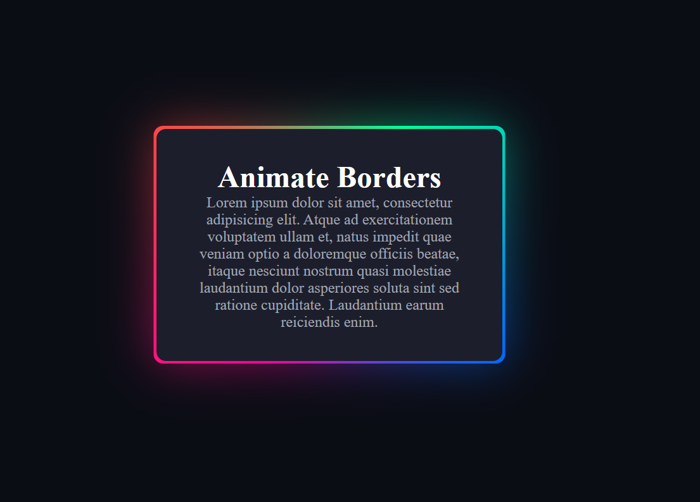

# CSS Border Animation

This project demonstrates a beautiful border animation effect using pure CSS and the `@property` rule, along with `conic-gradient` and keyframe animations. The animation continuously rotates a gradient around the border of a card element.

## Result

The result of the border animation can be viewed by opening the `index.html` file in your browser.

## Features

- Dynamic animated border using `conic-gradient`.
- Smooth infinite rotation with CSS keyframes.
- Blurred outer glow effect for a modern look.

